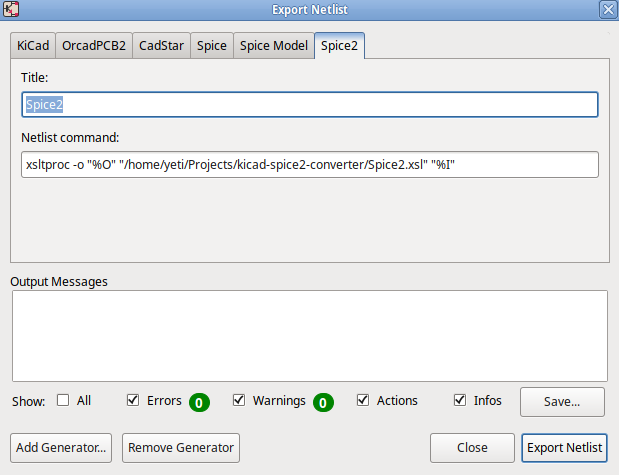
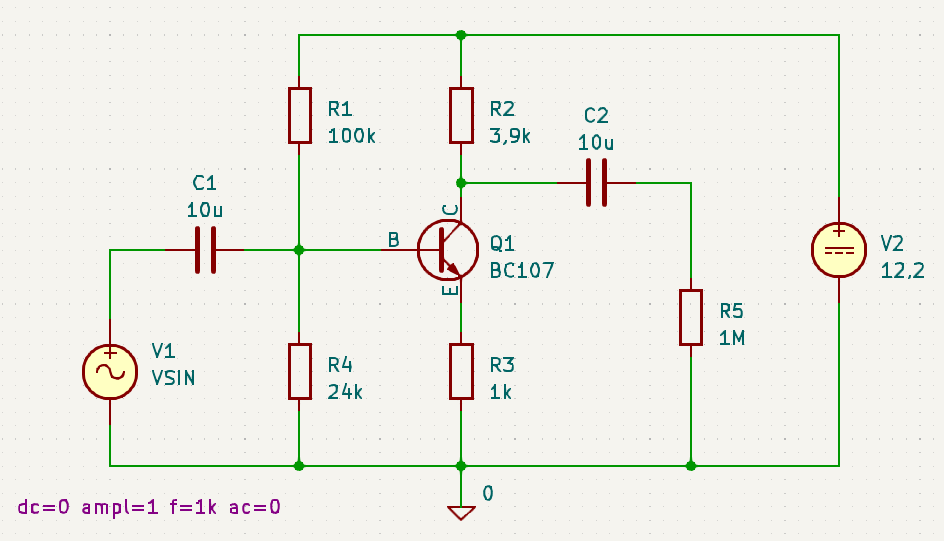
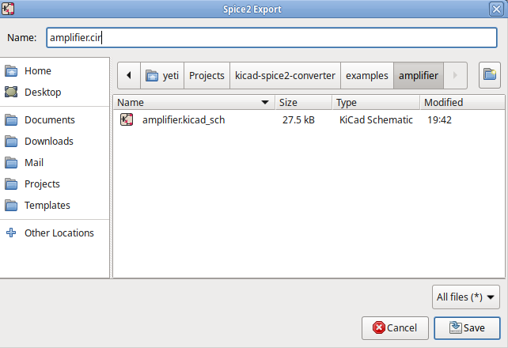

This script generates [SPICE2](https://github.com/yeti01/spice2) netlists from the [KiCad](https://www.kicad.org) Schematic Editor.

Simulation commands (`.TRAN .DC .PRINT .PLOT`) have to be added manually to the file.

### Installation

* Open the "KiCAD Schematic Editor"
* Navigate to `File` -> `Export` -> `Netlist...`
* Choose `Add Generator...`
* In the next Window, choose `Browse Generators...`
* Choose the `Spice2.xsl` file from where you stored it

Now you have a new Tabpage `Spice2` from which you can export netlists.

### Example

* Create a drawing in the "KiCAD Schematic Editor"
* Navigate to `File` -> `Export` -> `Netlist...`
* Choose `Spice2`
* Push `Export Netlist`
* In the next Window, choose a location and a filename for your netlist

    * AMPLIFIER
    .MODEL BC107 NPN
    C1 4 2 10U
    C2 3 5 10U
    Q1 5 4 6 BC107
    R1 7 4 100K
    R2 7 5 3.9K
    R3 6 0 1K
    R4 4 0 24K
    R5 3 0 1M
    V1 2 0 SIN(0 1 1K)
    V2 7 0 12.2
    .END
